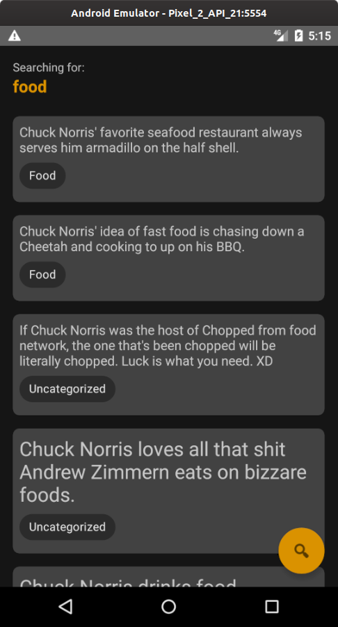

# Chuck Norris App

## Introduction
Android application using all that I know at the moment and [Chuck Norris Facts API](https://api.chucknorris.io/).

There is a lot of dependencies inside this project (at least that's what I think). Although, it's also a showcase project, I tried to show what are my skills using these APIs. Maybe the complexity was overkill to its size, but I think it was the best decision.

Each of the features has its on [branch](https://github.com/bfpimentel/chuck-norris-app/branches) and all of them are mapped inside the issue [Feature Roadmap](https://github.com/bfpimentel/chuck-norris-app/issues/1). I followed the [**conventional**](https://www.conventionalcommits.org/en/v1.0.0/) [commits messages](https://github.com/bfpimentel/chuck-norris-app/commits/develop).

There are no instrumentation tests since I don't know much about it and I couldn't manage to do them to be useful to the project. Also, I didn't want to take more than one week to do this project.

Also, my UI/UX skills are bad.

## Setup Instructions
Just clone the project wherever you want and open it with Android Studio, no further setup needed :)

The sync can take a little long because of the number of dependencies inside the project.

## Architecture Explanation
I choose to modularize just the project layers instead of the features because there were just two screens and there are no plans to add more. I focused on ease to scale and to maintain, following Clean Architecture principles.

    
    
<i>This is a representation of the architecture, the connection between UseCases are not obligatory, more details below.</i>

### :app
This is the presentation layer, it is responsible for what the user sees.

- **Fragment**: The Fragment is responsible to talk with the ViewModel. It hears the user inputs and the ViewModel outputs. 
- **ViewModel**: It expects the Fragment inputs and calls the UseCases, from *domain* module, then, it can output the data to the Fragments via LiveData observers. All the ViewModels in this project also have a Navigator.
- **Navigator**: It navigates or pops to other fragments.

---
### :domain
This is the domain layer, it holds the entities and it is responsible to talk to *data* module.

- **UseCase**: It is responsbile for the business rules on the application, it talks directly to the repositories inside data module or another use cases.

---
### :data
This is the data layer, it does not contain any business rules, it is responsible to get data from local or remote data sources.

- **Repository**: It is just a composition of local or remote data sources.
- **DataSource**: It is responsbile to talk with the remote server or local database.

---
## Features
### Facts

    
    

These are the Facts screen. The first screen is when the user is first accessing it (or at least when there are not any searches yet), and the second one is when the user already searched for something and the screen is listing its results.

---
### Search

    

This is the Search screen. It contains a search field for manual searching, a suggestions list and the last searches. After making a search, the user is redirected back to the *Facts* screen.

- **Search field**: It accepts just text and numbers, it is used to search for something manually, besides the suggestions. The search can be triggered tapping on the search icon in the field or on the keyboard.
- **Suggestions**: A list of suggestions that comes from the API firstly, after they come from the local database, it is random and it's always 8 of them. If the last search term is equal to one of the suggestions, it's going to be in a different color. Any of them can be tapped to be used as a search term.
- **Last searches**: A list of the last ten searches, ordering the most recent to the oldest. Any of them can be tapped to be used as a search term. There is an issue explaining how I made the listing: [Last Searches Rules](https://github.com/bfpimentel/chuck-norris-app/issues/24).

---
## Continuous Integration
The project uses Github Action to run the [CI script](./.github/workflows/android-pr.yml) when a Pull Request is opened or a Tag is created.

### Pull Request
- **Static code analysis**: The script uses the *detekt* gradle plugin to check if all the code is formatted consistently and there is not **any** issues with complexity.
- **Code coverage**: *JUnit5* is responsible for running the unit tests, *Jacoco* is responsible for generating the test report and then Codecov.io checks if the coverage is the expected.

    

 

---
### Tag
- **APK build and upload**: The script generates a debug apk and uploads it as an Github Action artifact.

## Drafts

    
    

